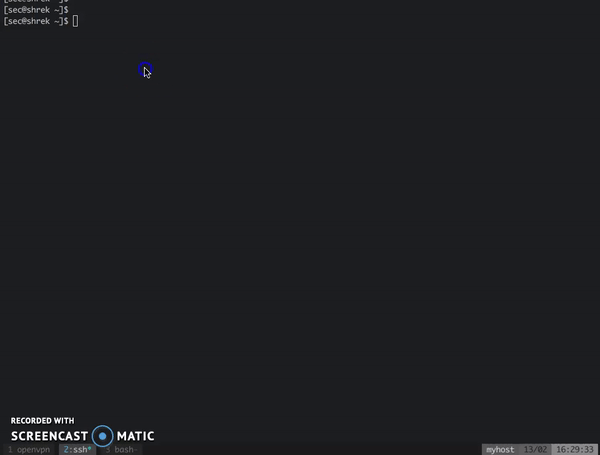

# pspy - monitor Linux processes without root permissions

pspy is a command line tool allowing you to snoop on Linux processes without being root.
It can help you to find and analyse cron jobs or other background processes that would otherwise be hidden from you (e.g., a cron job in `/var/spool/cron/root`).
pspy works by using inotify to monitor file system events and a simple scan of `/proc` to find processes.
Inotify events are used as a trigger for `/proc` scanning to not miss short-lived processes.

## Getting started

Get the tool onto the machine you want to inspect.
You can choose between the 32 and 64 bit version.
It will only work on Linux.
No other OS is supported as the project relies on Linux kernel features.

You can run `pspy --help` to learn about the flags and their meaning.
The summary is as follows:
- -p: enables printing commmands to stdout (enabled by default)
- -f: enables printing file system events to stdout (disabled by default)
- r: list of directories to watch. pspy will watch all these subdirectories recursively.
- -d: list of directories to watch. pspy will only watch these directories. No watchers are placed on the subdirectories.

### Examples

```bash
# print both commands and file system events, but watch only two directories (one recursive, one not)
pspy64 -pf -r /path/to/my/dir -d /path/to/my/other/dir

# disable printing commands but enable file system events
go run pspy/main.go -p=false -f
```

This is an example from the machine Shrek by [Hack The Box](https://www.hackthebox.eu/).
In this CTF challenge, the task is to exploit a hidden cron job that's changing ownership of all files in a folder.
With pspy, the cron job is easy to find and analyse:



## How it works

Linux comes with tools to monitor processes spawned on the system.
One example I know is called [forkstat](http://smackerelofopinion.blogspot.de/2014/03/forkstat-new-tool-to-trace-process.html).
It received notifications from the kernel on process-related events such as fork and exec.

Unfortunately, the tool required root priviledges so you cannot use it to right away.
However, nothing stop you in general from snooping on the processes running on the system.
All data is visible as long as the process is running.
The only problem is you have to catch short-lived processes in the very short timeframe in which they are alive.
Scanning the `/proc` directory for new PIDs in an infinite loop allows doing that but consumes a lot of CPU.

A stealthier way is to use the following trick.
Process tend to access files such as libraries in `/usr`, temporary files in `/tmp`, log files in `/var`, ...
Without root permissions, you can get notifications whenever these files are touched.
The API for this is[inotify](http://man7.org/linux/man-pages/man7/inotify.7.html).
While we cannot monitor processes direclty, we can monitor their interactions with the file system.

The trick now is to use these file system events as a trigger to scan `/proc`, hoping that we can do it fast enough to catch the process.
This is essentially what pspy does.
Thus, it has a good chance of capturing most processes, but there is no guarantee you won't miss one.
In general, the longer the processes run, the bigger the chance of catching them is.

Besides using the events, pspy will also scan `/proc` every 100ms, just to be sure.
My initial experiments suggest the CPU usage is quite low for this value.
Making the interval configurable is on the roadmap.
